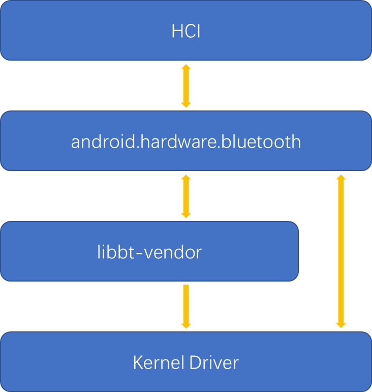

# HCI (Host Controller Interface) 接口层

---

### **蓝牙架构**


---

## **Transport 层**

* Transport 位于 HCI 和 硬件之间，是蓝牙的硬件发送协议

* Transport 在硬件接口上封装的软件协议

* 常见的 Transport 协议有基于 UART 的 H4, H5, BCSP, 基于 USB 的 H2

* Android 采用 H4 Protocol

---

### **H4 Protocol**

- H4 Protocol 仅仅在 HCI 数据包前增加一个字节的 Type

  | HCI packet type             | HCI packet indicator |
  | --------------------------- | -------------------- |
  | HCI Command packet          | 0x01                 |
  | HCI ACL Data packet         | 0x02                 |
  | HCI Synchronous Data packet | 0x03                 |
  | HCI Event packet            | 0x04                 |
  | HCI ISO Data packet         | 0x05                 |

- 数据包格式

  | - 1 byte - | ---- N byte HCI raw data ---- |
  | H4 Type - | ------- HCI RAW DATA ------- |

<!-- 
HCI COMMAND:由蓝牙协议栈发送给芯片的命令
HCI ACL:蓝牙协议栈跟蓝牙芯片双向交互的普通数据
HCI SCO:蓝牙芯片跟蓝牙协议栈双向交互的通话/语音识别等音频数据
HCI EVENT:由蓝牙芯片上报给蓝牙协议栈的事件
HCI ISO（这部分是在core5.2才添加）:用于发送LE audio
 -->

---

## **HCI 概述**

* 蓝牙常用数据总线有 UART, SDIO, USB 等

* 协议栈需要屏蔽硬件差异

* 模组驱动位于 Linux kernel

* 设备驱动接口和蓝牙的开关实现在蓝牙芯片关联的 libbt-vendor 中

* HCI 层作为协议栈和芯片之间的桥梁，提供收/发线程工作队列，实现对命令和数据的收发操作



---

## **HCI 文件结构**

HCI 层代码在 `system/bt/hci` 和 `hardware/interfaces/bluetooth` 目录下，主要包含以下几个重要文件

* **hci_layer.cc:** 提供 `hci interface` 给协议栈，提供数据收发的接口
  * **hci_layer_android.cc:** Android `hci_layer` 的实现

* **packet_fragmenter.cc:** 对 `hci` 数据包进行分解和重组

* **btsnoop.cc:** btsnoop 实现

* **bluetooth_hci.cc:** hci 接口转换

* **vendor_interface.cc:** hci 接口实现

* **h4_protocol.cc:** H4 协议实现

---

## **HCI Interface**

HCI 接口结构体声明如下：

```h
typedef struct hci_t {
  // Set the callback that the HCI layer uses to send data upwards
  void (*set_data_cb)(
      base::Callback<void(const base::Location&, BT_HDR*)> send_data_cb);

  // Send a command through the HCI layer
  void (*transmit_command)(BT_HDR* command,
                           command_complete_cb complete_callback,
                           command_status_cb status_cb, void* context);

  future_t* (*transmit_command_futured)(BT_HDR* command);

  // Send some data downward through the HCI layer
  void (*transmit_downward)(uint16_t type, void* data);
} hci_t;
```

<!-- 
set_data_cb: HCI 数据包上报的回调设置接口
transmit_command: 发送带有回调的命令包
transmit_command_futured: 发送命令包并等待状态信号量
transmit_downward: 发送数据包
 -->

---

## **初始化**

<!-- 
@startuml

skinparam monochrome true
scale 2
title HCI 初始化

bluetooth.cc -> bluetooth.cc: init();
bluetooth.cc -> stack_manager.cc: init_stack();
stack_manager.cc -> stack_manager.cc: event_init_stack();
stack_manager.cc -> btif_core.cc: btif_init_bluetooth();
btif_core.cc -> bte_main.cc: bte_main_boot_entry();
bte_main.cc -> hci_layer.cc: hci_layer_get_interface();
hci_layer.cc -> hci_layer.cc: hci_layer_get_interface_legacy();
hci_layer.cc -> hci_layer.cc: init_layer_interface();
note right: init_layer_interface 中，初始化 hci 的关键接口，set_data_cb...

bluetooth.cc -> bluetooth.cc: enable();
bluetooth.cc -> stack_manager.cc: start_up_stack_async();
stack_manager.cc -> stack_manager.cc: event_start_up_stack();
stack_manager.cc -> hci_layer.cc: hci_module_start_up();
note right: 通过 module.cc 的 module_start_up() 进行调用\n启动初始化超时的定时器，启动 hci 线程

hci_layer.cc -> hci_layer.cc: message_loop_run();
note right: 在 hci 线程中调用 hci_initialize

hci_layer.cc -> hci_layer_android.cc: hci_initialize();
note right: hic_initialize() 调用远程服务，实例化 btHci 接口，\n实现对 libbt-vendor 的调用

hci_layer_android.cc -> bluetooth_hci.cc: BluetoothHci::initialize();
bluetooth_hci.cc -> vendor_interface.cc: VendorInterface::Initialize();

@enduml
 -->

-HCI%20接口层/蓝牙协议栈(02)-HCI%20接口层.png)

<!-- 
新版本 BlueDroid 中，stack_manager.cc 直接调用 bte_main.cc 的 bte_main_init() 函数，省略了 btif_core.cc
 -->

---

### **init_layer_interface**

- `init_layer_interface` 初始化 hci 接口

```cpp
static void init_layer_interface() {
  if (!interface_created) {
    // It's probably ok for this to live forever. It's small and
    // there's only one instance of the hci interface.

    interface.set_data_cb = set_data_cb;
    interface.transmit_command = transmit_command;
    interface.transmit_command_futured = transmit_command_futured;
    interface.transmit_downward = transmit_downward;
    interface_created = true;
  }
}
```

---

### **hci_module_start_up**

- 初始化 `command_credits` 变量

  ```cpp
    // The host is only allowed to send at most one command initially,
    // as per the Bluetooth spec, Volume 2, Part E, 4.4 (Command Flow Control)
    // This value can change when you get a command complete or command status
    // event.
    command_credits = 1;
  ```

- 初始化定时器

  ```cpp
    // hci 启动超时定时器
    startup_timer = alarm_new("hci.startup_timer");
    ...
    // hci 命令应答定时器
    command_response_timer = alarm_new("hci.command_response_timer");
  ```

---

- 初始化 `hci` 线程

  ```cpp
    thread = thread_new("hci_thread");
  ```

- 初始化命令应答等待队列

  ```cpp
    commands_pending_response = list_new(NULL);
  ```

- 初始化启动完成信号量，启动定时器

  ```cpp
    // Make sure we run in a bounded amount of time
    future_t* local_startup_future;
    local_startup_future = future_new();
    startup_future = local_startup_future;
    alarm_set(startup_timer, startup_timeout_ms, startup_timer_expired, NULL);
  ```

---

- 初始化 `packet_fragmenter`

  ```cpp
    packet_fragmenter->init(&packet_fragmenter_callbacks);
  ```

- 启动 `hci` 线程

  ```cpp
    thread_post(thread, message_loop_run, NULL);
  ```

---

### **message_loop_run**

- 调用 `hci_initialize` 继续完成初始化工作

  ```cpp
    message_loop_->task_runner()->PostTask(FROM_HERE,
                                           base::Bind(&hci_initialize));
  ```

- 进入循环，等待消息处理

  ```cpp
    run_loop_->Run();
  ```

---

### **hci_initialize**

- 绑定 `android.hardware.bluetooth` 服务

  ```cpp
  void hci_initialize() {
    LOG_INFO(LOG_TAG, "%s", __func__);

    btHci = IBluetoothHci::getService();
    // If android.hardware.bluetooth* is not found, Bluetooth can not continue.
    CHECK(btHci != nullptr);
    LOG_INFO(LOG_TAG, "%s: IBluetoothHci::getService() returned %p (%s)",
             __func__, btHci.get(), (btHci->isRemote() ? "remote" : "local"));

    // Block allows allocation of a variable that might be bypassed by goto.
    {
      android::sp<IBluetoothHciCallbacks> callbacks = new BluetoothHciCallbacks();
      btHci->initialize(callbacks);
    }
  }
  ```

---

### **BluetoothHci::initialize**

```cpp
  bool rc = VendorInterface::Initialize(
      [cb](bool status) {
        auto hidl_status = cb->initializationComplete(
            status ? Status::SUCCESS : Status::INITIALIZATION_ERROR);
        if (!hidl_status.isOk()) {
          ALOGE("VendorInterface -> Unable to call initializationComplete()");
        }
      },
      [cb](const hidl_vec<uint8_t>& packet) {
        auto hidl_status = cb->hciEventReceived(packet);
        if (!hidl_status.isOk()) {
          ALOGE("VendorInterface -> Unable to call hciEventReceived()");
        }
      },
      [cb](const hidl_vec<uint8_t>& packet) {
        auto hidl_status = cb->aclDataReceived(packet);
        if (!hidl_status.isOk()) {
          ALOGE("VendorInterface -> Unable to call aclDataReceived()");
        }
      },
      [cb](const hidl_vec<uint8_t>& packet) {
        auto hidl_status = cb->scoDataReceived(packet);
        if (!hidl_status.isOk()) {
          ALOGE("VendorInterface -> Unable to call scoDataReceived()");
        }
      });
  if (!rc) {
    auto hidl_status = cb->initializationComplete(Status::INITIALIZATION_ERROR);
    if (!hidl_status.isOk()) {
      ALOGE("VendorInterface -> Unable to call initializationComplete(ERR)");
    }
  }
```

---

### **VendorInterface::Initialize**

```cpp
bool VendorInterface::Initialize(
    InitializeCompleteCallback initialize_complete_cb,
    PacketReadCallback event_cb, PacketReadCallback acl_cb,
    PacketReadCallback sco_cb) {
  if (g_vendor_interface) {
    ALOGE("%s: No previous Shutdown()?", __func__);
    return false;
  }
  g_vendor_interface = new VendorInterface();
  return g_vendor_interface->Open(initialize_complete_cb, event_cb, acl_cb,
                                  sco_cb);
}
```

---

### **VendorInterface::Open**

- 加载 libbt-vendor

  ```cpp
    ...
    // Initialize vendor interface

    lib_handle_ = dlopen(VENDOR_LIBRARY_NAME, RTLD_NOW);
    if (!lib_handle_) {
      ALOGE("%s unable to open %s (%s)", __func__, VENDOR_LIBRARY_NAME,
            dlerror());
      return false;
    }

    lib_interface_ = reinterpret_cast<bt_vendor_interface_t*>(
        dlsym(lib_handle_, VENDOR_LIBRARY_SYMBOL_NAME));
    if (!lib_interface_) {
      ALOGE("%s unable to find symbol %s in %s (%s)", __func__,
            VENDOR_LIBRARY_SYMBOL_NAME, VENDOR_LIBRARY_NAME, dlerror());
      return false;
    }
    ...
  ```

---

- 绑定蓝牙 mac 地址

  ```cpp
    ...
    // Get the local BD address

    uint8_t local_bda[BluetoothAddress::kBytes];
    if (!BluetoothAddress::get_local_address(local_bda)) {
      LOG_ALWAYS_FATAL("%s: No Bluetooth Address!", __func__);
    }
    int status = lib_interface_->init(&lib_callbacks, (unsigned char*)local_bda);
    if (status) {
      ALOGE("%s unable to initialize vendor library: %d", __func__, status);
      return false;
    }

    ALOGD("%s vendor library loaded", __func__);
    ...
  ```

---

- 上电，获取 socket

  ```cpp
    ...
    // Power on the controller

    int power_state = BT_VND_PWR_ON;
    lib_interface_->op(BT_VND_OP_POWER_CTRL, &power_state);
    
    // Get the UART socket(s)

    int fd_list[CH_MAX] = {0};
    int fd_count = lib_interface_->op(BT_VND_OP_USERIAL_OPEN, &fd_list);

    if (fd_count < 1 || fd_count > CH_MAX - 1) {
      ALOGE("%s: fd_count %d is invalid!", __func__, fd_count);
      return false;
    }

    for (int i = 0; i < fd_count; i++) {
      if (fd_list[i] == INVALID_FD) {
        ALOGE("%s: fd %d is invalid!", __func__, fd_list[i]);
        return false;
      }
    }
  ```

---

- 初始化 Protocol

  ```cpp
    event_cb_ = event_cb;
    PacketReadCallback intercept_events = [this](const hidl_vec<uint8_t>& event) {
      HandleIncomingEvent(event);
    };

    if (fd_count == 1) {
      hci::H4Protocol* h4_hci =
          new hci::H4Protocol(fd_list[0], intercept_events, acl_cb, sco_cb);
      fd_watcher_.WatchFdForNonBlockingReads(
          fd_list[0], [h4_hci](int fd) { h4_hci->OnDataReady(fd); });
      hci_ = h4_hci;
    } else {
      hci::MctProtocol* mct_hci =
          new hci::MctProtocol(fd_list, intercept_events, acl_cb);
      fd_watcher_.WatchFdForNonBlockingReads(
          fd_list[CH_EVT], [mct_hci](int fd) { mct_hci->OnEventDataReady(fd); });
      fd_watcher_.WatchFdForNonBlockingReads(
          fd_list[CH_ACL_IN],
          [mct_hci](int fd) { mct_hci->OnAclDataReady(fd); });
      hci_ = mct_hci;
    }
    ...
  ```

<!-- 
初始化 Protocol 后，使用 fd_wacher 监听 socket, 当有数据更新的时候，调用 Protocal 的 OnDataReady 方法
 -->

---

- 固件加载

  ```cpp
    // Start configuring the firmware
    firmware_startup_timer_ = new FirmwareStartupTimer();
    lib_interface_->op(BT_VND_OP_FW_CFG, nullptr);
  ```

---

## **数据发送**

<!-- 
@startuml

skinparam monochrome true
scale 2
title HCI 数据发送

hci_layer.cc -> hci_layer.cc: transmit_command();\ntransmit_command_futured();\ntransmit_downward();
note right: transmit_command 用于发送带回调的命令数据包\ntransmit_command_futured 用于发送命令数据包并等待信号量\ntransmit_downward 用于发送数据包

hci_layer.cc -> hci_layer.cc: enqueue_command();\nenqueue_packet();
note right: enqueue_command 将命令做队列处理\nenqueue_packet 将数据包做队列处理

hci_layer.cc -> hci_layer.cc: event_command_ready();\nevent_packet_ready();
note right: event_command_ready 将命令记录，等待回调，然后发送数据\nevent_packet_ready 直接发送数据包

hci_layer.cc -> packet_fragmenter.cc: fragment_and_dispatch();
packet_fragmenter.cc -> hci_layer.cc: transmit_fragment();
note right: packet_fragmenter 在 hci_module_start_up 中完成初始化，并注册回调\n这里就是通过注册的回调调用 hci_layer.cc 的函数

hci_layer.cc -> hci_layer_android.cc: hci_transmit();
hci_layer_android.cc -> bluetooth_hci.cc: BluetoothHci::sendHciCommand();\nBluetoothHci::sendAclData()\nBluetoothHci::sendScoData()
note right: hci_transmit 根据数据包的类型，\n调用 BluetoothHci::sendHciCommand(), BluetoothHci::sendAclData()\n或者 BluetoothHci::sendScoData()

bluetooth_hci.cc -> bluetooth_hci.cc: BluetoothHci::sendDataToController();
bluetooth_hci.cc -> vendor_interface.cc: VendorInterface::Send();
vendor_interface.cc -> h4_protocol: H4Protocol::Send();

@enduml
 -->

-HCI%20接口层/蓝牙协议栈(02)-HCI%20接口层-1.png)

---

### **transmit_xxx**

| 函数                    | 用途                                 |
| ----------------------- | ------------------------------------ |
| transmit_command        | 发送命令，收到应答后执行回调         |
| transmit_command_future | 发送命令，收到应答后发送信号量       |
| transmit_downward       | 发送数据，也可以用于发送命令(无回调) |

---

### **transmit_command**

```cpp
static void transmit_command(BT_HDR* command,
                             command_complete_cb complete_callback,
                             command_status_cb status_callback, void* context) {
  waiting_command_t* wait_entry = reinterpret_cast<waiting_command_t*>(
      osi_calloc(sizeof(waiting_command_t)));
  // 初始化 wait_entry
  uint8_t* stream = command->data + command->offset;
  STREAM_TO_UINT16(wait_entry->opcode, stream);
  wait_entry->complete_callback = complete_callback;
  wait_entry->status_callback = status_callback;
  wait_entry->command = command;
  wait_entry->context = context;

  // Store the command message type in the event field
  // in case the upper layer didn't already
  command->event = MSG_STACK_TO_HC_HCI_CMD;
  // wait_entiry 入发送队列
  enqueue_command(wait_entry);
}
```

<!-- 
transmit_command 将协议栈需要发送的命令，加上回调函数，打包成 waiting_command_t, 然后调用 enqueue_command 将这个命令入队列处理
 -->

---

### **enqueue_command**

```cpp
static void enqueue_command(waiting_command_t* wait_entry) {
  base::Closure callback = base::Bind(&event_command_ready, wait_entry);

  std::lock_guard<std::mutex> command_credits_lock(command_credits_mutex);
  if (command_credits > 0) { // 如果发送队列为空，直接发送
    if (!hci_thread.DoInThread(FROM_HERE, std::move(callback))) {
      // HCI Layer was shut down or not running
      buffer_allocator->free(wait_entry->command);
      osi_free(wait_entry);
      return;
    }
    command_credits--;
  } else { // 如果发送队列不为空，将命令入队列等待
    command_queue.push(std::move(callback));
  }
}
```

<!-- 
enqueue_command 会根据命令队列情况，决定是将命令入队列发送还是直接发送
命令的发送通过调用 event_command_ready 函数
 -->

---

### **event_command_ready**

```cpp
static void event_command_ready(waiting_command_t* wait_entry) {
  {
    // 将命令加入应答等待的队列
    /// Move it to the list of commands awaiting response
    std::lock_guard<std::recursive_timed_mutex> lock(
        commands_pending_response_mutex);
    wait_entry->timestamp = std::chrono::steady_clock::now();
    list_append(commands_pending_response, wait_entry);
  }
  // Send it off
  packet_fragmenter->fragment_and_dispatch(wait_entry->command);
  // 更新命令应答定时器
  update_command_response_timer();
}
```

<!-- 
event_command_ready 通过调用 packet_fragmenter 的 fragment_and_dispatch 函数将命令发送出去，此外，这个函数将 wait_entry 添加到 commands_pending_response 列表中，以等待回复，这个数据会在后续接收到的其他设备发送回来的数据时，在 filter_incoming_event 通过数据类型的匹配进行处理
此外，这里还更新了等待回复的定时器
 -->

---

### **transmit_fragment**

```cpp
static void transmit_fragment(BT_HDR* packet, bool send_transmit_finished) {
  // 记录 hci 数据包
  btsnoop->capture(packet, false);
  // HCI command packets are freed on a different thread when the matching
  // event is received. Check packet->event before sending to avoid a race.
  bool free_after_transmit =
      (packet->event & MSG_EVT_MASK) != MSG_STACK_TO_HC_HCI_CMD &&
      send_transmit_finished;

  // 发送数据包，根据包类型，调用 btHci 不同接口
  hci_transmit(packet);

  if (free_after_transmit) {
    buffer_allocator->free(packet);
  }
}
```

---

## **回调设置**

<!-- 
@startuml

skinparam monochrome true
scale 2
title HCI 回调设置

== hci 数据包回调设置 ==
bte_main.cc -> hci_layer.cc: hci->set_data_cb();\n由 bte_main_boot_entry 函数调用
note right: bte_main.cc 在 bte_main_boot_entry 函数中，完成了 hci 接口的初始化\n然后调用 hci 接口的 set_data_cb 函数，将数据回调绑定到 post_to_hci_message_loop\nset_data_cb 会将回调设置到 hci 的 send_data_upwards 变量上，从外部来的数据包会通过这个接口上报

== hci 接口回调设置 ==
hci_layer_android.cc -> hci_layer_android.cc: new BluetoothHciCallbacks();\n由 hci_initialize 函数调用
note right: BluetoothHciCallbacks() 里面定义了所有 hci 接口回调，从 hci下方上报的数据，会根据数据类型，\n走不同的回调接口，然后经过 package_fragmenter 的处理之后，通过 send_data_upwards 上报给协议栈

hci_layer_android.cc -> bleuetooth_hci.cc: BluetoothHci::initialize();
note right: 在 BluetoothHci::initialize() 中，传进来的 BluetoothHciCallbacks 各个回调函数会被重新打包成新的回调

bleuetooth_hci.cc -> vendor_interface.cc: VendorInterface::Initialize();

vendor_interface.cc -> vendor_interface.cc: VendorInterface::Open();
note right: VendorInterface::Open() 会调用具体的通信协议实现，\n将回调函数设置下去，比如说 H4 Protocol

== Protocol 回调设置 ==
vendor_interface.cc -> h4_protocol.cc: new hci::H4Protocol()
h4_protocol.cc -> hci_packetizer.cc: hci_packetizer_()
note left: H4Protocol 初始化会调用 hci_packetizer，\n将 hci_packetizer 的数据包回调 packet_ready_cb_ 绑定到 H4Protocol::OnPacketReady

@enduml
 -->

-HCI%20接口层/蓝牙协议栈(02)-HCI%20接口层-2.png)

---

## **数据接收**

<!-- 
@startuml

skinparam monochrome true
scale 2
title HCI 数据接收

async_fd_wacther.cc -> h4_protocol.cc: H4Protocol::OnDataReady();
note right: fd_watcher 监听 socket，当有数据来的时候，调用 OnDataReady

h4_protocol.cc -> hci_packetizer.cc: HciPacketizer::OnDataReady();
note right: H4Protocol 只处理数据包的第一个字节，判断数据包类型，\n剩下的交给 HciPacketizer 接收完整的一包数据

hci_packetizer.cc -> h4_protocol.cc: H4Protocol::OnPacketReady\n(packet_ready_cb_);
note right: 数据包接收完成后，HciPacketizer 通过回调调用 H4Protocol 的 OnPacketReady 方法

h4_protocol.cc -> bleutooth_hci.cc: VendorInterface::HandleIncomingEvent() -> lambda: event_cb\nlambda: acl_cl\nlambda: sco_cb
note right: H4Protocol 判断数据包的类型，并根据数据包类型执行相应的回调\nevent_cb 是经过 VendorInterface 包装之后的\n另外两个回调都是 BluetoothHci 定义的 lambda 函数

bleutooth_hci.cc -> hci_layer_android.cc: BluetoothHciCallbacks::hciEventReceived()\nBluetoothHciCallbacks::aclDataReceived()\nBluetoothHciCallbacks::scoDataReceived()
note left: BluetoothHci 定义的 lambda 函数直接调用 BluetoothHciCallbacks

hci_layer_android.cc -> hci_layer.cc: hci_event_received()\nacl_event_received()\nsco_data_received()
note left: hci_event_received 会先过滤过来的数据包，如果是之前发送的命令应答，会直接处理，否则直接上报

hci_layer.cc -> packet_fragmenter.cc: reassemble_and_dispatch()
note left: reassemble_and_dispatch 会对数据包进行组包，拿到一个完整的数据包之后上报

packet_fragmenter.cc -> hci_layer.cc: dispatch_reassembled()

hci_layer.cc -> bte_main.cc: post_to_hci_message_loop()\n(send_data_upwards)

@enduml
 -->

-HCI%20接口层/蓝牙协议栈(02)-HCI%20接口层-3.png)

---

### **H4Protocol::OnPacketReady**

```cpp
void H4Protocol::OnPacketReady() {
  switch (hci_packet_type_) {
    case HCI_PACKET_TYPE_EVENT:
      event_cb_(hci_packetizer_.GetPacket());
      break;
    case HCI_PACKET_TYPE_ACL_DATA:
      acl_cb_(hci_packetizer_.GetPacket());
      break;
    case HCI_PACKET_TYPE_SCO_DATA:
      sco_cb_(hci_packetizer_.GetPacket());
      break;
    default:
      LOG_ALWAYS_FATAL("%s: Unimplemented packet type %d", __func__,
                       static_cast<int>(hci_packet_type_));
  }
  // Get ready for the next type byte.
  hci_packet_type_ = HCI_PACKET_TYPE_UNKNOWN;
}
```

---

### **xxx_cb_**

- `event_cb_` 回调 `VendorInterface` 封装的方法，对 event 进行分发
- `acl_cb_` 和 `sco_cb_` 直接回调到协议栈

  ```cpp
  void VendorInterface::HandleIncomingEvent(const hidl_vec<uint8_t>& hci_packet) {
    if (internal_command.cb != nullptr &&
        internal_command_event_match(hci_packet)) {
      HC_BT_HDR* bt_hdr = WrapPacketAndCopy(HCI_PACKET_TYPE_EVENT, hci_packet);

      // The callbacks can send new commands, so don't zero after calling.
      tINT_CMD_CBACK saved_cb = internal_command.cb;
      internal_command.cb = nullptr;
      saved_cb(bt_hdr);
    } else {
      event_cb_(hci_packet);
    }
  }
  ```

---

### **hci_event_received**

- 记录数据包
- 进行事件分发

```cpp
void hci_event_received(const tracked_objects::Location& from_here,
                        BT_HDR* packet) {
  btsnoop->capture(packet, true);
  if (!filter_incoming_event(packet)) {
    send_data_upwards.Run(from_here, packet);
  }
}
```

---

### **acl(sco)_event_received**

- 记录数据包
- 将数据包交给 `packet_fragmenter` 处理(组包)

```cpp
void acl_event_received(BT_HDR* packet) {
  btsnoop->capture(packet, true);
  packet_fragmenter->reassemble_and_dispatch(packet);
}

void sco_data_received(BT_HDR* packet) {
  btsnoop->capture(packet, true);
  packet_fragmenter->reassemble_and_dispatch(packet);
}
```

---

## **btsnoop**

- 用于记录蓝牙协议栈和芯片交互的数据

- 开启方式
  - 开发者选项->启用蓝牙 HCI 信息收集日志
  - 设置属性 `persist.bluetooth.btsnoopenable`

- 日志文件保存在 `data/misc/bluetooth/logs/btsnoop_hci.log`

- 分析工具: WireShark, Frontline, Ellisys

---

## **HCI 数据包**

- HCI 分组格式
  
  | 类型     | 数据方向       | 说明                  |
  | -------- | -------------- | --------------------- |
  | 指令分组 | Host -> Slave  | 主机控制器指令        |
  | 事件分组 | Slave -> Host  | 响应主机命令的事件    |
  | 数据分组 | Host <-> Slave | 数据传输(ACL,SCO,ISO) |

- 结合 btsnoop 数据分析数据包格式

---

### **Command 数据包**

- 两字节操作码(OpCode)
  - OGF(Opcode Group Field): 高6位
  - OCF(Opcode Command Field): 低10位
- 参数总长度
- 参数


---

#### *OGF, OCF*

- 位于 `system/bt/stack/include/hcidefs.h`
- OGF 定义如下
  ```cpp
  /*
   *  Definitions for HCI groups
  */
  #define HCI_GRP_LINK_CONTROL_CMDS (0x01 << 10)       /* 0x0400 */
  #define HCI_GRP_LINK_POLICY_CMDS (0x02 << 10)        /* 0x0800 */
  #define HCI_GRP_HOST_CONT_BASEBAND_CMDS (0x03 << 10) /* 0x0C00 */
  #define HCI_GRP_INFORMATIONAL_PARAMS (0x04 << 10)    /* 0x1000 */
  #define HCI_GRP_STATUS_PARAMS (0x05 << 10)           /* 0x1400 */
  #define HCI_GRP_TESTING_CMDS (0x06 << 10)            /* 0x1800 */
  #define HCI_GRP_BLE_CMDS (0x08 << 10)               /* 0x2000 (LE Commands) */

  #define HCI_GRP_VENDOR_SPECIFIC (0x3F << 10) /* 0xFC00 */
  ```

---

### **Event 数据包**

- 一字节事件码
  - 定义在 `system/bt/stack/include/hcidefs.h`
- 一字节参数总长度


---

### **ACL(Asynchronous Connection-Less) 数据包**

- Handle: 连接句柄，用于蓝牙连接后数据交互
- PB flag: 用于上层数据(L2CAP), 标记是否是分隔数据
- PC flag: 标记是否是广播包
- Length: 数据包长度
- Data: 数据包


---

### **SCO(Synchronous Connection Oriented) 数据包**

- Handle: 连接句柄，用于蓝牙连接后数据交互
- Packet status flag: 标记数据包状态
- Length: 数据包长度
- Data: 数据包


