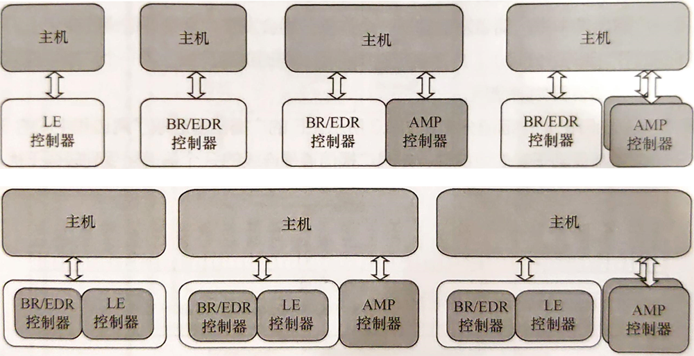
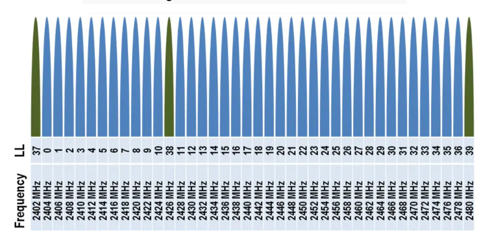
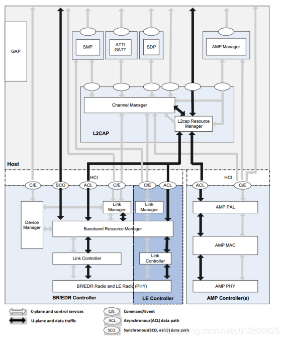
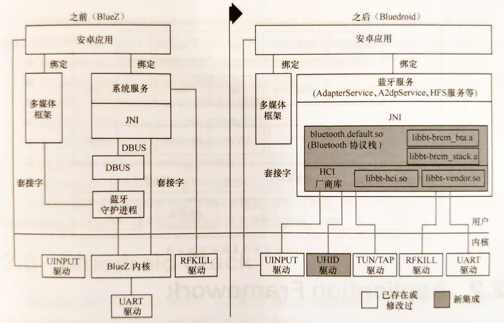

# 蓝牙协议栈--协议版本发展和系统架构

---

## **蓝牙历史版本**

到目前为止，蓝牙一共发布了了11个版本: 1.1/1.2/2.0/2.1/3.0/4.0/4.1/4.2/5.0/5.1/5.2

### **蓝牙1.1/1.2**

- 传输速率 1Mbit/s(理论), 实际 478~810kbit/s
- 1.2 标准加入 eSCO，提高语音通话质量

### **蓝牙2.0**

- 1.2 的改良版，传输速率提升到 3Mbit/s，实际 1.8~2.1Mbit/s
- 支持双重工作方式(语音+文件传输)

---

### **蓝牙2.1 + EDR**

- 改善配对流程，引入简单配对机制
- 更佳的省电效果

### **蓝牙3.0 + HS**

- 引入交替射频技术(Alternate MAC/PHY AMP)
- 传输速率 24Mbit/s
- 待机功耗降低

---

### **蓝牙4.0 + BLE**

- 引入 BLE, 低功耗, 低成本

### **蓝牙4.1**

- 引入 BR/EDR 安全连接
- 增强低功耗
- 提升连接速度

### **蓝牙4.2**

- 提升速度和隐私保护程度
- 通过 IPv6 和 6LoWPAN(IPv6 over IEEE 802.15.4)接入互联网

---

### **蓝牙5.0**

- 低功耗模式下具有更快更远的传输能力
- 蓝牙mesh

### **蓝牙5.1**

- 增加 AoA/AoD，号称厘米级误差定位

### **蓝牙5.2**

- 增加 BLE audio, LC3 的编解码方式

---

## **蓝牙4.0**

- 蓝牙3.0的升级标准
- 整合3种蓝牙规格(传统蓝牙，高速蓝牙和低功耗蓝牙)
- 允许多架构共存，可以分为单模式和双模式

---

### **新特性**

- 包含蓝牙低功耗
- 低功耗物理层
- 低功耗链路层
- 低功耗增强 HCI 层
- 低功耗直接测试模式
- 高级加密标准
- 属性协议(Attribute Protocol)
- 通用属性配置文件(Generic Attribute Profile)
- 安全管理(Security Manager)

---

### **核心系统**

- 核心系统由一个主机和多个控制器组成
- 主机：位于非核心配置文件(Profile)之下，主控制接口(HCI)之上
- 控制器：HCI 下面的所有层

#### 主控制器

- BR/EDR 控制器
- LE 控制器
- 组合的 BR/EDR 控制器和 LE 控制器

---

#### **信道**

- 蓝牙信道频率 2402MHz ~ 2480MHz
- BR/EDR 每个信道宽度为 1MHz, 共 79 个信道
- BLE 每个信道宽度为 2MHz, 共 40 个信道
- 0 ~ 36 为数据信道，37 ~ 39 为广播信道

#### **跳频**

- $$ F_{n+1} = (F_n + X) \pmod {37}

<!-- 跳频： -->
<!-- X 取 5 ~ 16 之间的数，使得跳频图图谱更加均匀，不至于两个频率隔得太近，以至于环境干扰无法通过跳频消除，也不至于频率隔得太远，造成功率转换带来的额外功耗 -->

<!-- 自适应跳频： -->
<!-- 每次数据传输之后我们进行对信道质量进行评估，如果我们认为当前信道质量较差，我们将它从可用信道列表中删除，这是一个通用的思路.具体到BLE中，自适应跳频技术是将一个坏掉（干扰严重）的信道映射到一个好信道，当跳频算法跳到该坏信道时，实际采用的是他映射的那个好的信道进行数据的传输。 -->

---

### **核心系统架构**

- BR/EDR Host
  - GAP SDP L2CAP

- BR/EDR Controller
  - LMP BB RF

- LE Host
  - GAP GATT ATT SM L2CAP

- LE Controller
  - IAL LL RFPHY
  <!-- IAL ISO 适配层, 配图未体现 -->
  <!-- 其实和 BR/EDR 基本一致, Controller由链路管理器(LMP), 基带资源管理器(BB), 链路控制器(LC)和射频层(RF)组成 -->

---

#### **最小配置**

- BR/EDR核心系统的最小配置
  - 四个底层：BR/EDR射频物理层（PHY）、链路控制器（LC）、基带资源管理器、链路管理器。
  - Service Discovery Protocol ：服务发现协议
  - Generic Access Profile：通用访问规范
  - 若BR/EDR支持AMPs，则配置中需包括：AMPs和协议适配层 (PALs)。
- LE核心系统的最小配置
  - 四个底层：BR/EDR射频物理层（PHY）、链路控制器（LC）、基带资源管理器、链路管理器。
  - Security Manage：安全管理
  - Attribute Protocol ：属性协议
  - Generic Attribute Profile：通用属性规范
  - Generic Access Profile：通用访问规范

---

#### **主机(Host)架构模块**

- Channel Manager：信道管理器，主要负责创建、管理和关闭用于传输服务协议和应用层数据流的L2CAP信道
  - 信道管理器利用L2CAP协议与远程（对端）终端上的信道管理器进行交互，以创建L2CAP信道
  - 信道管理器与本地链路管理器或AMP PAL进行交互，以创建新的逻辑链路和配置这些链路，从而为传输数据提供所需的服务质量

- L2CAP Resource Manager：L2CAP资源管理器
  - 主要负责管理传递给基带PDU片段的有序性和信道之间的调度， 以确保具有QoS承诺的L2CAP通道不会因为控制器资源耗尽而被拒绝访问物理通道
  <!-- PDU Protocol Data Unit 协议数据单元 -->
  - 还可能执行流量一致性政策，以保证提交的L2CAP SDU在协商的QoS范围内

---

- Security Manager Protocol：安全管理协议，端对端协议
  - 生成加密秘钥和身份标识秘钥，并存储
  - 使用专有的固有的L2CAP信道
  - 生成随机地址，并将随机地址解析为已知设备标
  - 直接与控制器交互，在加密和配对过程中提供加密和鉴权的秘钥

- Attribute Protocol：属性协议，端对端协议，服务器和客户端之间的协议
  - ATT客户端通过专用的固定L2CAP通道与远程设备上的ATT服务端通信
  - ATT客户端向ATT服务端发送命令、请求和确认
  - ATT服务端向客户端发送响应、通知和指示
  - ATT客户端的命令和请求提供了在ATT服务端的对等设备上读、写属性值的方法

---

- Generic Attribute Profile：通用属性规范，描述属性服务器的功能，选择性地描述属性客户端的功能
  - 描述了服务层次、特点，以及属性服务器的属性
  - 提供发现、读、写以及服务特点和属性的接口

- AMP Manager Protocol，AMP管理协议
  - 使用专有的L2CAP信号信道与远程设备的AMP管理器进行通信
  - 直接与AMP PAL交互，以便于AMP控制
  - 发现远程AMP，并确定其有效性
  - 收集远程AMP信息，以便于建立和管理AMP物理链路

- Generic Access Profile：通用访问规范，描述所有蓝牙设备的通用基本功能
  - GAP服务包括：设备发现、连接模式、安全、鉴权、服务发现、关联模型

---

#### BR/EDR/LE控制器架构模块

- Device Manager：设备管理器，用于控制蓝牙设备的行为，负责除数据传输外的所有蓝牙系统的操作
  - 搜索附近的蓝牙设备、连接蓝牙设备、标记本地蓝牙设备为可发现的、可连接的等
  - 为了执行相应的功能，设备管理器需要访问基带资源管理器的传输媒介
  - 设备资源管理器通过一系列HCI命令控制本地设备的行为，如管理设备名字，存储链路秘钥等
- Link Manager：链路管理器，负责创建、修改或释放逻辑链路，以及更新设备之间的相关物理链路参数
  - 链路管理器利用链路管理协议（LMP, ER/EDR）或链路层协议（LL，LE）与远程蓝牙设备的链路管理器通信
  - LM、LL协议允许在设备之间创建新的逻辑链路和逻辑通道，控制逻辑链路和通道的属性，如使能链路安全、调整BR/EDR物理链路的发送功率、逻辑链路的QoS设置

---

- Baseband Resource Manager：基带资源管理器，负责所有无线媒介的访问
  - 时间调度器，负责给已协商约定的所有访问实体分配物理信道时间
  - 协商约定，与访问实体协商访问参数，以便于给用户程序提供一个确定的QoS质量
  - 时间调度和协商约定必须考虑到需要主控制器的所用行为，包括已连接设备在逻辑链路和逻辑通道上的所有数据交互，执行查询、连接、可被发现、可连接、可读等的无线媒介使用情况

- Link Controller：链路控制器
  - 编解码蓝牙数据包。蓝牙数据包为物理信道、逻辑传输和逻辑链路的相关数据负载和参数
  - 携带链路控制协议信令（ BR/EDR）或链路层协议（LE），包括流控、确认、重传请求信令

- PHY：物理层，负责物理信道上数据的发送和接收

---

### APM控制器架构模块

- AMP HCI：AMP主机控制器接口，AMP控制器与主机之间的逻辑接口
  - 支持AMPs需要额外的与AMP物理信号和逻辑信道管理、QoS、流控相关的HCI命令和事件
  - 一个AMP控制器对应一个HCI逻辑实体，一个BR/EDR控制器对应一个HCI逻辑实体。当多个控制器在同一个物理单元时，一个物理HCI传输层管理多个复用在同一物理传输线上的控制器

- AMP PAL：AMP协议适应层，AMP MAC与Host之间的接口
  - 将Host命令或事件转化成MAC服务命令或事件，将MAC服务命令或事件转化为host能明白的命令和事件
  - 支持AMP信道管理、基于特定流控模板的数据流量管理、电源效率管理等

- AMP MAC：AMP MAC层

- AMP PHY：AMP物理层

---

## **蓝牙协议栈**

- Android 使用 BlueDroid 蓝牙协议栈, 位于 `system/bt` 目录下，也可以单独获取源码

- 协议栈源码地址: `https://android.googlesource.com/platform/system/bt`

- 变更历史: Bluez -> Bluedroid (Fluoride) -> Gabeldorsh
<!-- Gabeldorsh 是 Google 正在开发的新蓝牙协议栈，使用 Rust 语言进行开发 -->

---

### **Bluedroid 对比 Bluez**

- 层次结构清晰
<!-- 层次结构清晰：各个 Profile 对上层接口统一，便于新增 Profile，增加 HAL 层和 GKI(内核接口)，便于移植 -->

- 移除 DBus
<!-- 移除 DBus：应用层的 Java 代码直接调用 BLuedroid 的 Native 代码 -->

- 协议栈运行在用户空间
<!-- 协议栈运行在用户空间：方便编译调试，也保障内核稳定 -->

---

### **代码结构**

- Applicaton Framework
  - 提供给应用蓝牙接口，使用 Binder IPC 调用蓝牙进程服务(`frameworks/base/core/java/android/bludtooth`)
- Bluetooth Process
  - 实现 Bluetooth Service 和各种 Profile，通过 JNI 调用 HAL(`package/apps/Bluetooth`)
- Bluetooth JNI
  - 直接调用 HAL, 并给 HAL 提供相应的回调(`package/apps/Bluetooth/jni`)
- Bluetooth HAL
  - 定义 android.bluetooth APIs 和 BLuetooth Process 调用的标准接口(`hardware/libhardware/include/hardware/bluetooth.h`)
<!-- bluetooth.h: 包含蓝牙硬件操作，设备管理和是被操作抽象接口 -->
- Bluedroid Stack
  - 实现 HAL 层定义(`system/bt`)

---

#### **Bluedroid Stack**

- Bleutooth Embedded System(BTE)
  - 蓝牙嵌入系统，实现 BT 的核心功能，通过 HCI 与蓝牙芯片交互实现蓝牙协议栈的通用功能和相关协议
- Bluetooth Application Layer(BTA)
  - 蓝牙应用层，用于和 Android Bluetooth Service 交互，实现蓝牙设备管理、状态管理以及一些应用规范
- Bluetooth Interface Layer(BTIF)
  - 蓝牙接口层，Android Bluetooth Service 和 BTA 的 Profile 接口层，相当于桥接的作用。此外还提供协议栈和内核之间交互的桥接
- HCI层
  - 位于蓝牙系统的 L2CAP 层和 LMP 层之间的一层封装，为上层协议提供了进入 LM 的统一接口和进入基带的统一方式，同时也是蓝牙芯片向协议栈报告事件的通道
<!-- L2CAP 资源管理器 LM 链路管理器 -->
<!-- HCI不包含在协议栈里面，提供 so 库供协议栈加载和使用 -->

---

#### **Bluedroid 代码结构**

##### **main**

用于 BTE 核心栈的初始化和卸载

主要文件 `bte_main.cc`, `bte_init.cc`

<!-- 由此处的 Android.bp 定义蓝牙协议栈的编译，生成 libbluetooth.so -->

---

##### **bta**

用于和 Bluetooth Process 层交互，主要组件如下：

- ag, 实现 BTA 音频网关(audio gateway)
- ar, 负责 audio/video 注册
- av, 实现 BTA advanced audio/video
- dm, 实现 BTA 设备管理
- gatt, 实现通用属性配置文件(Generic Attribute Profile)
<!-- BLuetooth 4.0 新增的核心协议 -->
- hl, 实现 HDP(Health Device Profile) 协议
<!-- HDP 协议主要用于与健康设备的蓝牙连接，不如心率监护仪、血压检测仪、体温计等 -->
- pan, 实现 PAN(蓝牙个人局域网) 协议，使设备可以连接一下设备：个人区域网用户(PANU)设备、组式临时网络(GN)设备、网络访问点(NAP)设备
<!-- PAN 主要用于数据传输 -->
- hh, 实现 HID(Human Interface Device)协议
<!-- HID 典型应用包括蓝牙遥控器、蓝牙鼠标、蓝牙键盘、蓝牙游戏手柄 -->
- pbap, 实现 PBAP(Phone Book Access Profile)协议
<!-- PBAP 用于从电话簿交换服务器上获取电话簿内容 -->
- sys, 主要实现 BTA 系统管理

---

##### **btif**

提供所有 Bluetooth Process 需要的API

##### **hci**

HCI library 的实现，主要包括 HCI 接口的打开和收/发控制、vendor so 的打开和回调函数的注册、LPM 的实现、btsnoop 的抓取等

##### **stack**

主要用于完成各协议在 Bluedroid 中的实现，协议包括 a2dp
avct advdt avcr bnep gap gatt hid l2cap pan rfcomm sdp macp smp 等

- btm
  - 主要涉及 Bluetooth Manager
- btu
  - 主要用于核心协议层之间的事件处理与转换
