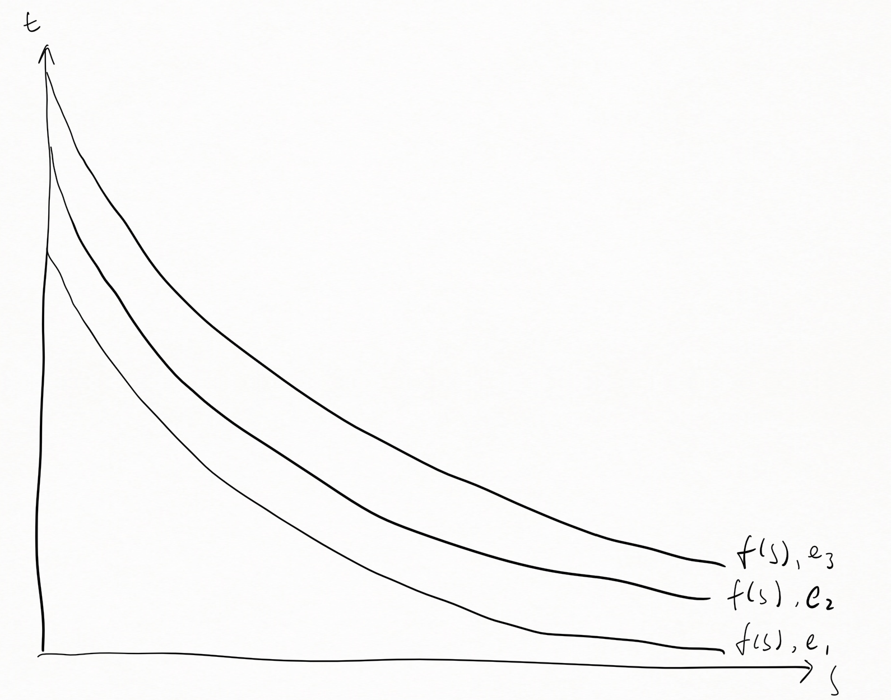
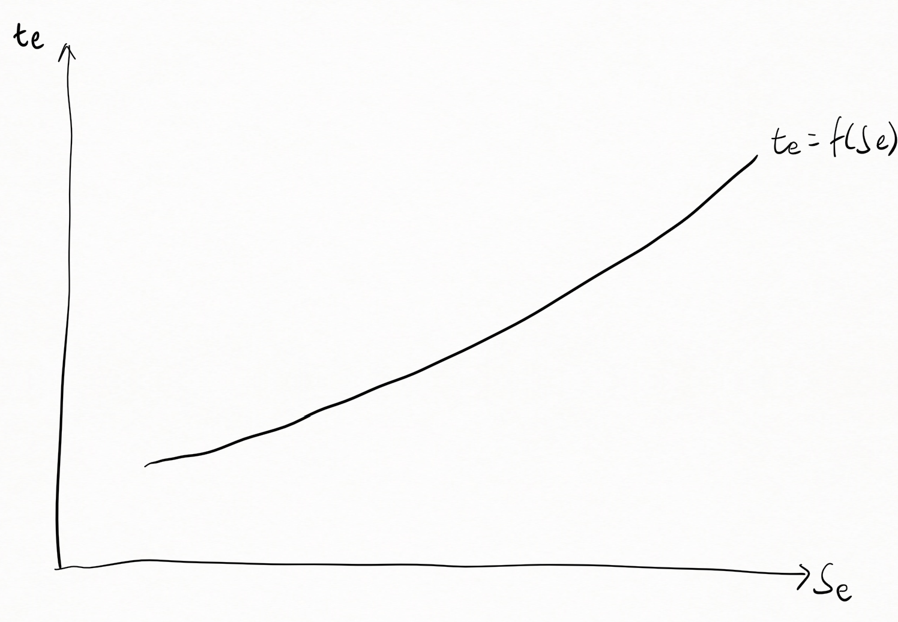

# 投影仪风扇控制策略

## 原理分析

投影仪工作时，由灯源发出的大量热量，导致光机温度上升，在无主动散热的情况下，高温会直接导致机器损坏，所以必须采取主动散热的措施

投影仪稳定工作时，其发热能力也是稳定的，如果引入稳定的散热能力，则会将温度也维持在一个稳态，调整散热能力，也同时会控制稳态温度

目前投影仪引入的主动散热措施为风扇，那么其散热能力就决定于风扇的转速`s`，与之对应的，会有一个稳态温度`t`，在保持`s`不变的情况下，稳态温度`t`会根据环境(气温，通风条件，湿度)`e`变化，我们假定环境`e`稳定，那么`s`和`t`就会导出一个关系式
$$ t = f(s) $$
在每一个`e`下，都会有一个对应的`f(s)`

在某一个环境`e1`下，我们在曲线上选取一个点作为理想的稳态，记录一个稳态状态`(s1, t1)`，在另一个环境`e2`下，记录另一个稳态状态`(s2, t2)`，记录所有的稳态状态后，我们可以得到一个理想的稳态曲线

$$ t_e = f(s_e) $$

这个稳态曲线表示理想状态下，系统达到平衡时的`s`和`t`的状态，任意时刻，我们得到`s`和`t`的实际值，在坐标系上表示成点`P(s, t)`，若`P`点位于稳态曲线上，表明当前系统已经达到稳态，若`P`点位于稳态曲线上方，表示此时系统散热能力不够，需要增大`s`，使`P`点向稳态曲线靠近，反之，若`P`点位于稳态曲线下方，表明当前系统散热能力溢出，需要减小`s`

## 调节策略

从原理来看，我们控制系统温度，就是通过控制风扇转速`s`，使系统达到稳态，那么如何控制`t`呢，这里提出两种方案

1. 最短路径直接控制

    假设某个时间，系统未达到稳态，此时状态为`P1(s1, t1)`，我们求出这个点到稳态曲线上最近的点`P2(s2, t2)`，然后直接控制`t`到`t2`

2. PID 控制

    使用 PID 控制，输出量为`t`，误差为当前状态`P1(s1, t1)`到稳态曲线的距离，目标为控制`P`点位于稳态曲线上
